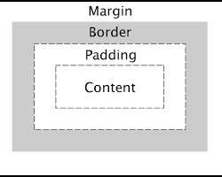

# CSS Box Model - Box Label Lab 🏷️



## Project Overview

Master the **CSS Box Model** through theory and practice. Learn the concepts, then build a "User Profile Card" component that visually demonstrates each layer of the box model.

## 📁 Project Structure

```
w2_box_label_lab/
├── README.md                 # Project overview
├── lesson/
│   └── README.md            # Box Model theory and concepts
└── lab/
    ├── README.md            # Hands-on lab instructions
    ├── index.html           # Your HTML (to be created)
    ├── styles.css           # Your CSS (to be created)
    └── package.json         # Testing configuration
```

## Getting Started

### 1. Fork & Clone
```bash
git clone https://github.com/your-username/w2_box_label_lab.git
cd w2_box_label_lab
```

### 2. Study Theory → Practice → Test
1. **Learn**: Read [`lesson/README.md`](lesson/README.md) for box model concepts
2. **Build**: Follow [`lab/README.md`](lab/README.md) to create your profile card
3. **Validate**: Run `npm install` then `npm test`

## Submission

```bash
git add .
git commit -m "Complete User Profile Card Lab"
git push origin main
```

---

**Ready to master the CSS Box Model?** Start with the [lesson materials](lesson/README.md), then dive into the [hands-on lab](lab/README.md)! 🎯
